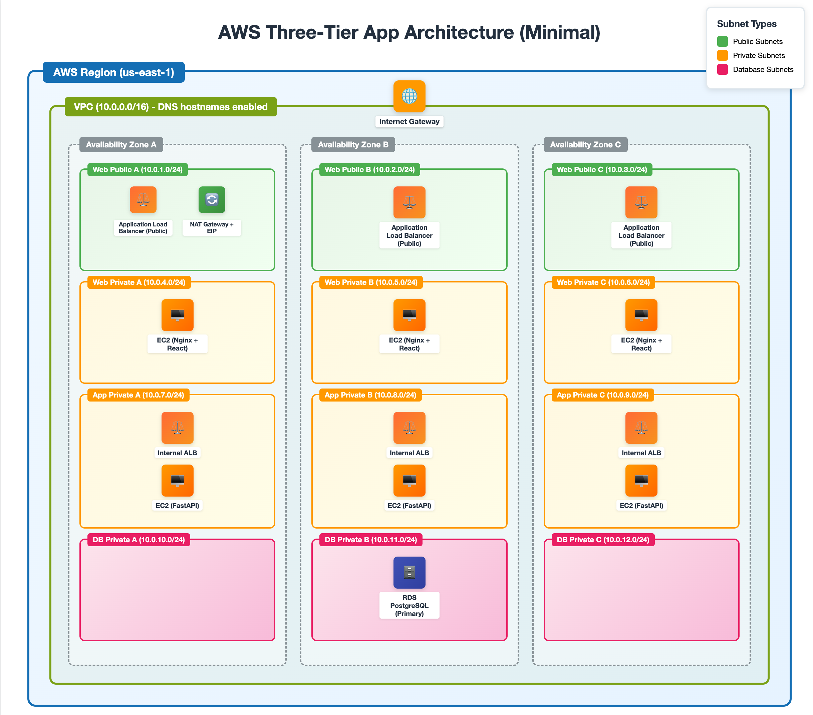
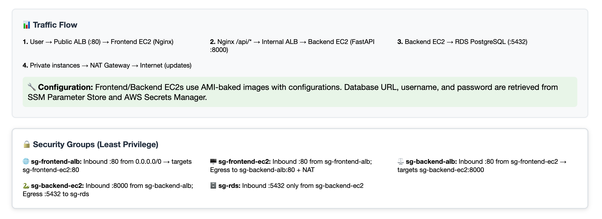
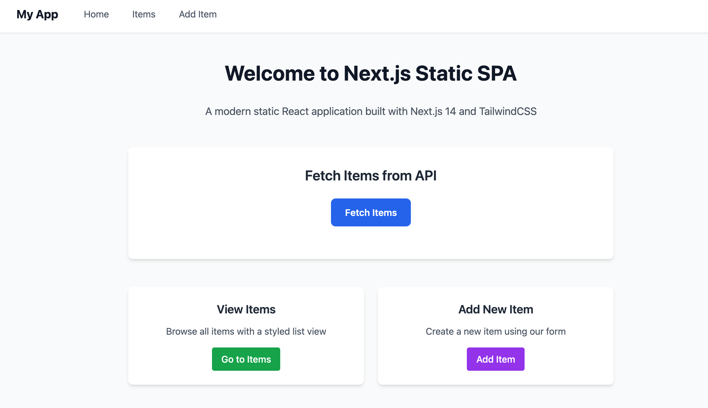

## Project Overview

This repository contains a small **3-tier web application** deployed on AWS. The stack follows a classic separation of concerns:

- **Frontend (Web tier):** A React single-page app served by **Nginx on EC2**, fronted by a **public Application Load Balancer (ALB)**. Instances run in **private web subnets**; only the ALB is internet-facing.
- **Backend (App tier):** A FastAPI service (Uvicorn on **:8000**) running on **EC2** behind an **internal ALB**. Instances run in **private app subnets** and are reachable only from the frontend tier.
- **Database (Data tier):** **Amazon RDS for PostgreSQL** deployed in **private DB subnets** with no public access.

**Request flow**

Client → **Frontend ALB (public)** → **Nginx/EC2 (private)** → `/api/*` → **Backend ALB (internal)** → **FastAPI/EC2 (private)** → **RDS PostgreSQL (private)**

**Networking & Security (at a glance)**

- One **VPC** with dedicated subnets per tier (web/app/db) across multiple AZs.
- **IGW** for public ingress (to the frontend ALB) and **NAT Gateway** for private egress.
- **Security groups** enforce least-privilege paths: ALB→EC2 (web), web→app, app→DB.
- Runtime configuration is injected at boot (backend ALB DNS via **SSM Parameter Store**, DB credentials via **Secrets Manager**) to keep AMIs generic.

**Purpose**

- Provide a **portfolio-friendly**, production-style reference for a 3-tier app on AWS.
- Demonstrate core AWS services: **VPC, Subnets, Route Tables, IGW/NAT, ALBs, EC2 (Auto Scaling), RDS**.

---

## Infrastructure Steps (Summary)

- **Networking:** VPC, public/private subnets, route tables, IGW, NAT Gateway.  
- **Security:** Security groups with least-privilege access between tiers.  
- **Database:** RDS PostgreSQL in private DB subnets.  
- **Compute:** EC2 AMIs (frontend + backend), Launch Templates, Auto Scaling Groups.  
- **Load Balancing:** Public ALB (frontend) and internal ALB (backend).  
- **Configuration:** SSM Parameter Store for backend ALB DNS, Secrets Manager for DB credentials.  

---

## Architecture

  

---

## Demo

---

## Full Walkthrough

For a detailed step-by-step guide (with scripts, challenges, and lessons learned), see my blog post here: [link coming soon].
